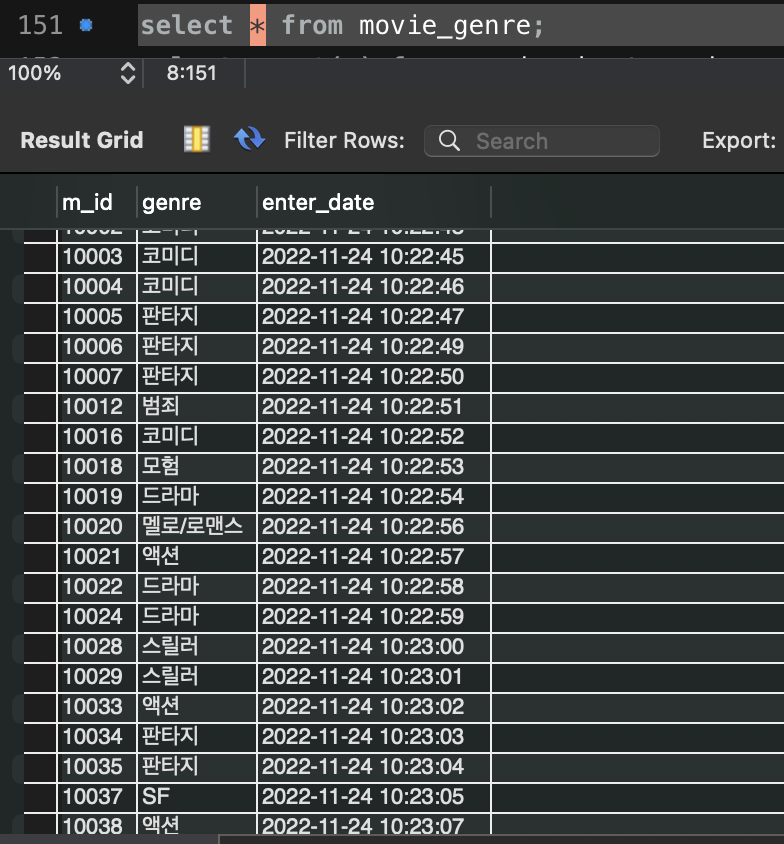

# 네이버 영화 크롤링

네이버 영화 사이트의 랭킹에서 상위 2000개를 뽑고, 그에 대한 각종 데이터들을 수집하여 데이터셋을 구축하는 파이썬 프로그램

## 프로그램 실행 환경

- Python 3.10.6
- PyMySQL 1.0.2
- Selenium 4.6.0
- MySQL

## 프로그램 개요

- `naver_movie_main.py`

  해당 프로그램의 엔트리 포인트이다. 아래의 crawl 함수들을 차례대로 수행한다.

- `crawl_naver_movie_ranking_list(conn, cur, driver, page)`

  현재 페이지(ranking page)에서 영화들의 리스트를 가져온다.

- `crawl_movie(conn, cur, url, mid, driver)`

  `naver_top_ranked_movie_list` 테이블에서 mid를 가져오면, 해당 영화로 접근하여 `movie` table에  insert한다. 또한, 해당 영화의 장르를 `genre` 테이블에 insert한다.

- `crawl_review(conn, cur, mid, driver)`

  mid로 해당 영화의 리뷰 페이지로 접근하여 `review` table에 insert한다. (리뷰 페이지는 최대 10페이지까지만 받아오도록 하였다)

- `crawl_movie_person(conn, cur, url, driver)`

  movie url을 통하여 영화 페이지로 접근하여 해당 영화에 출연한 인물들을 `movie_person` table에 insert한다. 배우, 감독, 단역, 특별 출연을 구분하여 넣어주었다. 또한 pid가 없는 경우(일부 존재)에는 0 또는 -1을 넣어주도록 하였다.

- `crawl_person(conn, cur, pid, driver)`

  `movie_person` table에서 distinct pid를 가져와, 해당 인물페이지로 접근하여 `person` table에 insert한다.

- `db_conn54.py`

  - `get_movie_list(cur)`

    `naver_top_ranked_movie_list` 테이블에서 영화들의 배열을 리턴한다.

  - `get_person_pid(cur)`

    `movie_person` 테이블에서 영화인의 pid 배열을 리턴한다.

- `naver_login.py`

  - parameter : `driver`
  - return : `driver`
  - 성인 영화등에 대하여 url로 접근시 회원 인증이 필요하므로, 미리 로그인 시켜놓도록 한다. 다만, 2차 인증이 필요한 계정이라면 불가능하므로 단순 id, pw로만 로그인이 가능하고, 성인인증이 된 네이버 계정이 필요하다.

## 프로그램 실행 결과(MySQL workbench)

- select * from naver_top_ranked_movie_list; (총 2000개)

  

- select * from movie; (총 2000개)

  

- select * from genre; (총 2000개)

  

- select * from movie_short_review; (총 199900개 *리뷰 없는 영화 하나 제외 1999개 영화에서 100개씩 추출)

  

- select * from movie_person; (총 64526개)

  

- select * from person; (총 39242개, movie_person에서 겹치는 pid를 제외하고 pid가 없는 경우를 제외한 수와 같음)

  

  